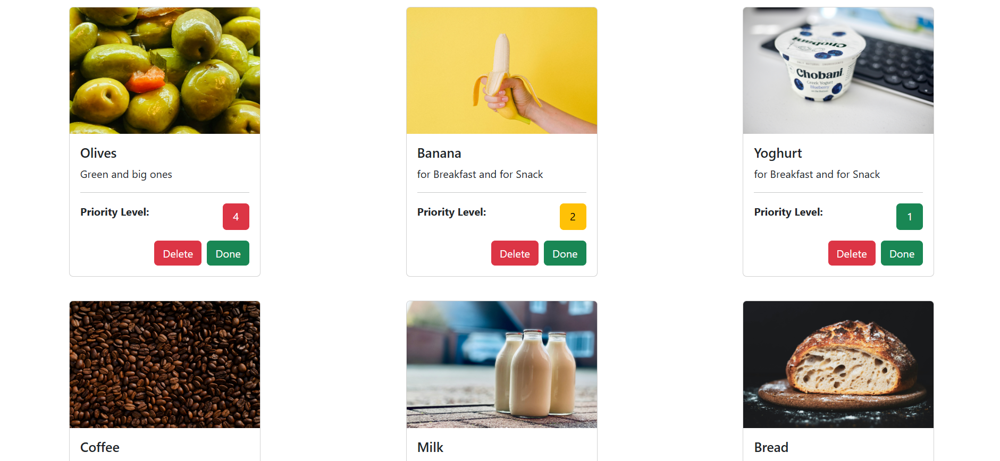
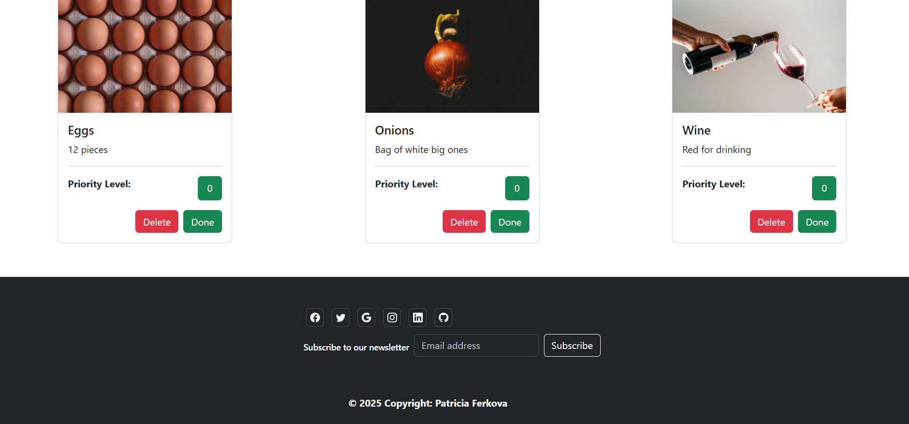

# Shopping List

## Project Overview

A responsive JavaScript-based item management interface built with Bootstrap.  
The application dynamically renders items from a data model and allows users to update priority levels, sort items, and reset state through interactive UI controls.

---


---

## Tech Stack

- HTML5
- Bootstrap 5 for layout and responsive UI components
- JavaScript (ES6) for data handling and DOM manipulation

## JavaScript Architecture

- Items are stored as an array of objects, each representing a single item with metadata such as name, description, image, and priority level.
- The UI is generated dynamically based on the data model, keeping the DOM in sync with application state.
- User interactions (priority changes, sorting, resetting) update the data first and then re-render the interface.

---



---

## Key Features & Logic

- **Dynamic rendering** of Bootstrap cards from a JavaScript data structure
- **Priority system** with visual feedback using color-coded Bootstrap badges
- **Sorting functionality** based on item priority
- **State reset and update logic** without page reloads
- **Responsive layout** using Bootstrap’s grid system

## Design Decisions

- A data-driven approach was chosen to separate application state from the UI.
- Bootstrap cards and grid classes are used to ensure consistent layout across screen sizes.
- UI updates are centralized through a render function to keep behavior predictable.

---



---

## Challenges & Learnings

- Keeping UI state consistent when modifying item priorities
- Re-rendering dynamic content efficiently after sorting or resetting data
- Structuring JavaScript logic for readability without frameworks

## Setup & Usage

```bash
git clone https://github.com/PatFerko/Shopping-List
cd Shopping-List
```
